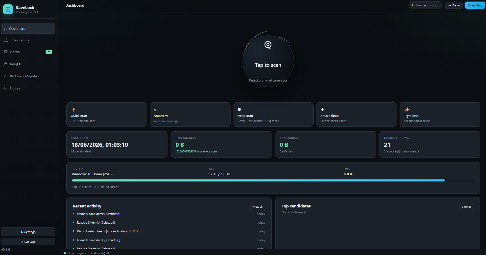
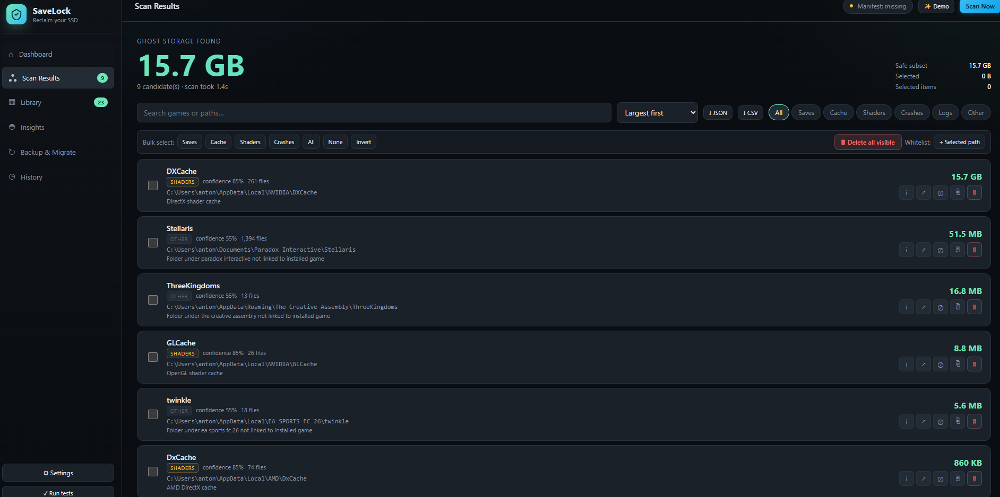

# SaveMeGB

> Reclaim gigabytes of SSD space by finding orphaned game saves and caches.

SaveMeGB is a Windows desktop app that scans your installed games and finds leftover save data, shader caches, and other reclaimable space. Everything is moved to the Recycle Bin first — nothing is permanently deleted unless you explicitly choose Force Delete.



## What it does

- 🔍 **Scans 9 launchers** — Steam, Epic, Xbox, GOG, Battle.net, Riot, EA, Ubisoft, and manual installs
- 🗑️ **Finds orphaned saves** — game folders that no installed game references
- 📊 **Categorizes by type** — saves, cache, shaders, crash dumps, logs, settings, backups
- ♻️ **Safe by default** — moves to Recycle Bin, never permanent delete (unless you opt in)
- 📈 **Beautiful insights** — donut chart of categories, bar chart by publisher, top reclaimable items
- 🖼️ **Library view** — your games with Steam cover art
- 🌗 **Dark + light themes** — pick your vibe
- 🌍 **Multi-language paths** — handles accented characters, Unicode

## Demo

Watch a 30-second scan in action:

[▶ Watch the demo](assets/demo-recording.mp4)

## Screenshots

| Dashboard | Scan Results |
|---|---|
|  |  |

## Quick start

### Download

Grab the latest release from [Releases](https://github.com/Ntooxx/SaveMeGB/releases) — installer and portable .exe available.

### Build from source

```bash
git clone https://github.com/Ntooxx/SaveMeGB.git
cd SaveMeGB
npm install
npm run tauri dev      # dev mode with hot-reload
npm run tauri build    # release build (creates installer in src-tauri/target/release/bundle/)
```

Requires Node 18+, Rust 1.75+, and the [Tauri 2 prerequisites](https://tauri.app/start/prerequisites/) for your platform.

## How it works

```
┌─────────────────────────────────────────────────────────────┐
│  Scan starts                                                │
│  ┌──────────────┐  ┌──────────────┐  ┌──────────────┐      │
│  │  Steam       │  │  Epic        │  │  Xbox / GOG  │ ...  │
│  │  registry +  │  │  manifest    │  │  filesystem  │      │
│  │  appmanifest │  │  .item       │  │  heuristics  │      │
│  └──────┬───────┘  └──────┬───────┘  └──────┬───────┘      │
│         │                 │                 │              │
│         └─────────────────┼─────────────────┘              │
│                           ▼                                 │
│                  InstalledGames[]                            │
│                           │                                 │
│  ┌────────────────────────┼────────────────────────┐       │
│  │  Walk AppData + Documents + Saved Games         │       │
│  │  Skip known install paths, known publishers,   │       │
│  │  denylisted names, whitelisted paths            │       │
│  └────────────────────────┬────────────────────────┘       │
│                           ▼                                 │
│                  OrphanedFiles[]                            │
│                  (with category + confidence)                │
│                           │                                 │
│  ┌────────────────────────┼────────────────────────┐       │
│  │  User selects items + chooses strategy         │       │
│  │  - Recycle Bin (default, safe)                 │       │
│  │  - Backup folder (you pick)                   │       │
│  │  - Force Delete (locked cache files)          │       │
│  └────────────────────────┬────────────────────────┘       │
│                           ▼                                 │
│                  Bytes freed, errors if any                 │
└─────────────────────────────────────────────────────────────┘
```

See [docs/ARCHITECTURE.md](docs/ARCHITECTURE.md) for the full design.

## Roadmap

- [x] v0.1.0 — Open-source release (you are here)
- [ ] v0.2.0 — Pro tier with scheduled auto-clean ($2 lifetime, optional)
- [ ] v0.3.0 — Cloud backup of saves before delete (OneDrive / Dropbox sync)
- [ ] v0.4.0 — More launchers (Bethesda.net, Amazon Games, Itch.io)
- [ ] v0.5.0 — Localization (community-driven translations)
- [ ] v0.6.0 — Mac and Linux support
- [ ] v1.0.0 — Microsoft Store release

See [docs/ROADMAP.md](docs/ROADMAP.md) for the full plan.

## Why open source?

SaveMeGB is a tool that **deletes files from your computer**. Trust matters. By being open source, anyone can:

- Read the engine code and verify it only does what it says
- Audit the Recycle Bin integration
- Submit fixes for false positives
- Add support for their favorite launcher

The free version will always be free. A future **Pro tier** ($2 lifetime) will add scheduled auto-cleanup, cloud backup, and a few other niceties for users who want to set-and-forget.

## Contributing

We love contributions. See [CONTRIBUTING.md](CONTRIBUTING.md) for the guide.

Good first issues are tagged [`good first issue`](https://github.com/Ntooxx/SaveMeGB/issues?q=is%3Aissue+is%3Aopen+label%3A%22good+first+issue%22).

## License

MIT — see [LICENSE](LICENSE). Use it, fork it, sell it, whatever. Just don't sue us.

## Support

- 🐛 [Bug reports](https://github.com/Ntooxx/SaveMeGB/issues/new?template=bug_report.md)
- 💡 [Feature requests](https://github.com/Ntooxx/SaveMeGB/issues/new?template=feature_request.md)
- 🔒 [Security issues](https://github.com/Ntooxx/SaveMeGB/security/advisories/new)
- 💬 [Discussions](https://github.com/Ntooxx/SaveMeGB/discussions)

## Credits

- [Ludusavi manifest](https://github.com/mtkennerly/ludusavi-manifest) — the JSON file that tells us where thousands of games store their saves
- [Tauri](https://tauri.app/) — the Rust + WebView framework that makes this 5MB instead of 100MB
- [keyvalues-parser](https://crates.io/crates/keyvalues-parser) — Steam's VDF format
- [trash](https://crates.io/crates/trash) — cross-platform Recycle Bin integration
- All the [contributors](https://github.com/Ntooxx/SaveMeGB/graphs/contributors) who make this better

## Star history

If SaveMeGB saved you disk space, give us a ⭐. It helps others find the project.

---

Made with ❤️ by [Ntooxx](https://github.com/Ntooxx) and contributors.
